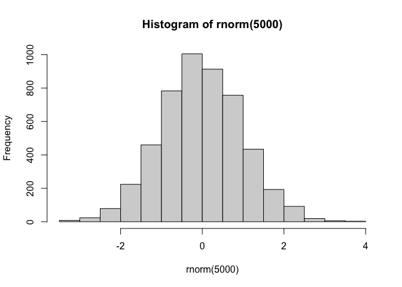
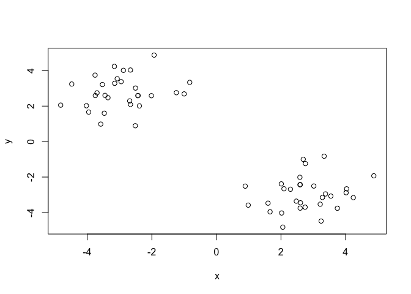
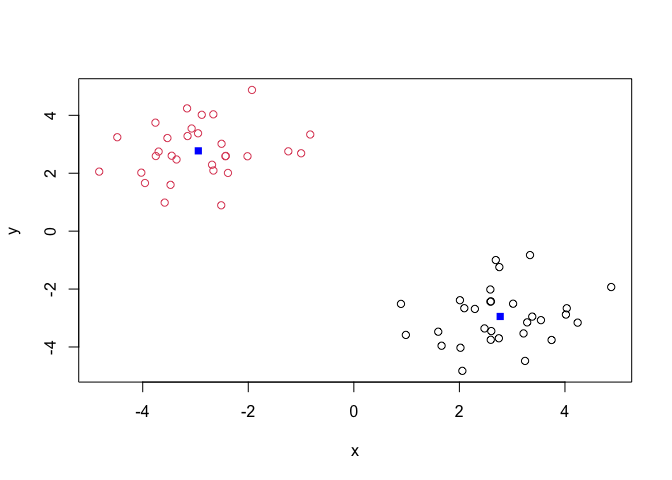
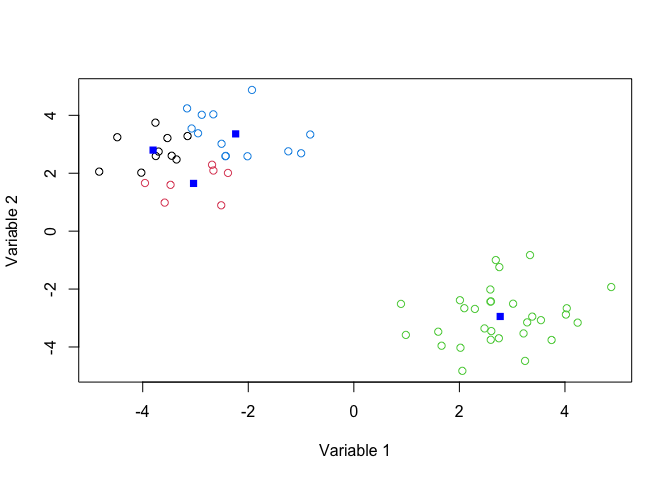
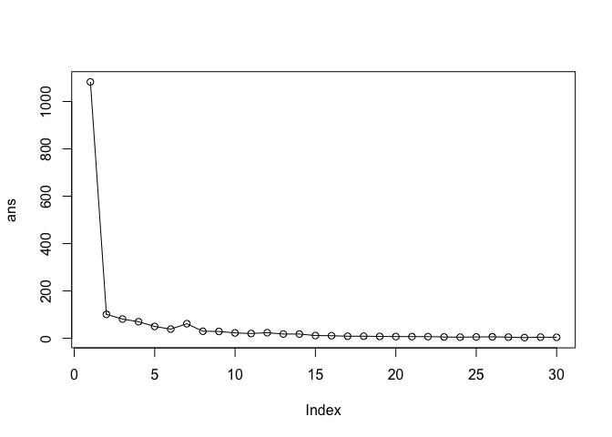
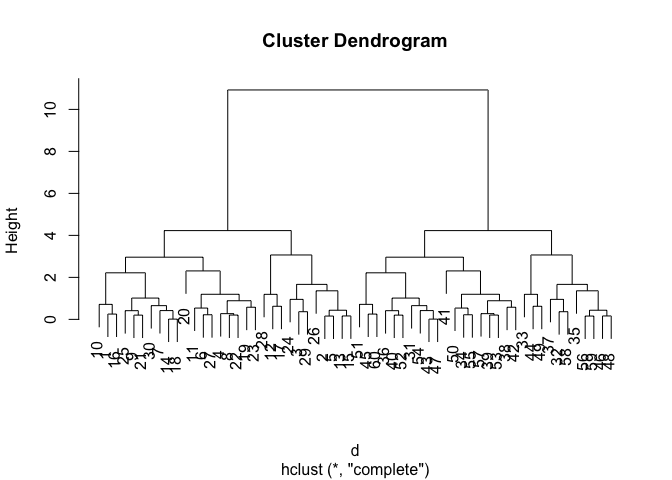
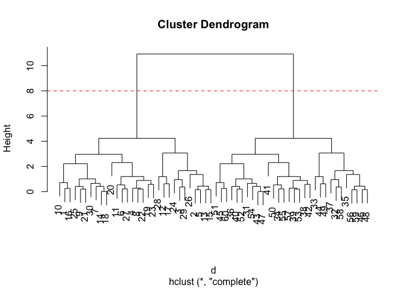

# Class 07: Machine Learning 1
Kimberly Navarro (A17485724)

- [Background](#background)
- [K-means clustering](#k-means-clustering)
- [Hierarchial Clustering](#hierarchial-clustering)
- [PCA of UK food data](#pca-of-uk-food-data)
- [Spotting major differences and
  trends](#spotting-major-differences-and-trends)
- [Pairs plots and heatmaps](#pairs-plots-and-heatmaps)
- [PCA to the rescue](#pca-to-the-rescue)

## Background

Today we will begin our exploration of some important machine learning
methods, namely **clusterring** and **dimensionality reduction**.

lets make up some input data for clustering where we know what natural
`clusters` are:

The function `rnorm()` can be useful here.

``` r
hist( rnorm(5000))
```



> Q. Generate 30 random numbers centered at +3 and another 30 centered
> at -3

``` r
tmp <- c(rnorm(30, mean=3),
rnorm(30, mean=-3) )

x <- cbind(x=tmp, y=rev(tmp))
plot(x)
```



## K-means clustering

The main function in “base R” for K means clustering is called
`kmeans()`:

``` r
km <- kmeans(x, centers = 2)
km
```

    K-means clustering with 2 clusters of sizes 30, 30

    Cluster means:
              x         y
    1  2.773144 -2.946607
    2 -2.946607  2.773144

    Clustering vector:
     [1] 1 1 1 1 1 1 1 1 1 1 1 1 1 1 1 1 1 1 1 1 1 1 1 1 1 1 1 1 1 1 2 2 2 2 2 2 2 2
    [39] 2 2 2 2 2 2 2 2 2 2 2 2 2 2 2 2 2 2 2 2 2 2

    Within cluster sum of squares by cluster:
    [1] 50.70733 50.70733
     (between_SS / total_SS =  90.6 %)

    Available components:

    [1] "cluster"      "centers"      "totss"        "withinss"     "tot.withinss"
    [6] "betweenss"    "size"         "iter"         "ifault"      

> Q. What component of the results object details the cluster sizes?

``` r
km$size
```

    [1] 30 30

> Q. What component of the results object details the cluster center?

> Q. What component of the results object details the cluster membership
> vector (i.e. our main result of which points lie in which cluster)?

``` r
km$cluster
```

     [1] 1 1 1 1 1 1 1 1 1 1 1 1 1 1 1 1 1 1 1 1 1 1 1 1 1 1 1 1 1 1 2 2 2 2 2 2 2 2
    [39] 2 2 2 2 2 2 2 2 2 2 2 2 2 2 2 2 2 2 2 2 2 2

> Q. Plot our clustering results which ppoints colored by clusters and
> also add the cluster centers as new points colored blue?

``` r
plot(x, col=c(km$cluster))
points(km$centers, col="blue", pch=15)
```



> Q. Run `kmeans()` again and this time produce 4 clusters and (call
> your result object `kd`) and make a results figure ike above?

``` r
kd <- kmeans(x, centers = 4)
plot(x, col = kd$cluster,
     xlab = "Variable 1", ylab = "Variable 2")
points(kd$centers, col = "blue", pch = 15)
```



The metric

``` r
km$tot.withinss
```

    [1] 101.4147

``` r
kd$tot.withinss
```

    [1] 74.17198

> Q. Let’s try different number of K(centers) from 1 to 30 and see what
> the best result is?

``` r
i <- 1
ans <- NULL 
for(i in 1:30) {
  ans <- c(ans, kmeans(x, centers = i)$tot.withinss)
}

ans
```

     [1] 1082.881177  101.414661   81.434384   70.145377   50.165100   38.876093
     [7]   61.726443   29.929822   28.901186   22.901474   20.435691   23.809192
    [13]   18.103062   18.193421   11.722391   11.082493    8.863110    9.072758
    [19]    7.942175    7.463603    7.175348    7.249665    5.650844    4.904907
    [25]    5.761490    6.480991    4.977254    2.970859    4.971427    4.321615

``` r
plot(ans, typ="o")
```



**Key-poit:** K-means will impose a clustering structure on your data
even if it is not there - it will always give you the answer you asked
for even if that answer is silly!

## Hierarchial Clustering

The main function for Hierarchical Clustering is called `hclust()`
Unlike `kmeans()` (which does all the work for you) you can’t just pass
`hclust()` our raw input data. It needs a “distance matrix” lke the new
one returned from the `dist()` function.

``` r
d <- dist(x)
hc <- hclust(d)
hc
```


    Call:
    hclust(d = d)

    Cluster method   : complete 
    Distance         : euclidean 
    Number of objects: 60 

``` r
plot(hc)
```



To extract our cluster membership vector from a `hclust()` result object
we do have to “cut” our tree at a given height to yield separate
“groups”/“branches”.

``` r
plot(hc)
abline(h=8, col="red", lty=2)
```



To do this we us the `cutree()` function on our `hclust()` object:

``` r
cutree(hc, h=8)
```

     [1] 1 1 1 1 1 1 1 1 1 1 1 1 1 1 1 1 1 1 1 1 1 1 1 1 1 1 1 1 1 1 2 2 2 2 2 2 2 2
    [39] 2 2 2 2 2 2 2 2 2 2 2 2 2 2 2 2 2 2 2 2 2 2

``` r
grps <- cutree (hc, h=8)
```

``` r
table(grps, km$cluster)
```

        
    grps  1  2
       1 30  0
       2  0 30

## PCA of UK food data

Import the dataset of food consumption in the UK:

``` r
url <- "https://tinyurl.com/UK-foods"
x <- read.csv(url)
x
```

                         X England Wales Scotland N.Ireland
    1               Cheese     105   103      103        66
    2        Carcass_meat      245   227      242       267
    3          Other_meat      685   803      750       586
    4                 Fish     147   160      122        93
    5       Fats_and_oils      193   235      184       209
    6               Sugars     156   175      147       139
    7      Fresh_potatoes      720   874      566      1033
    8           Fresh_Veg      253   265      171       143
    9           Other_Veg      488   570      418       355
    10 Processed_potatoes      198   203      220       187
    11      Processed_Veg      360   365      337       334
    12        Fresh_fruit     1102  1137      957       674
    13            Cereals     1472  1582     1462      1494
    14           Beverages      57    73       53        47
    15        Soft_drinks     1374  1256     1572      1506
    16   Alcoholic_drinks      375   475      458       135
    17      Confectionery       54    64       62        41

> Q. How many rows and columns are in your new data frame named x? What
> R functions could you use to answer this question?

``` r
dim(x)
```

    [1] 17  5

One solution to set the row names us to do it by hand…

``` r
rownames(x) <- x[,1]
```

To remove the first column I can use the minux index trick:

``` r
x <- x[,-1]
x
```

                        England Wales Scotland N.Ireland
    Cheese                  105   103      103        66
    Carcass_meat            245   227      242       267
    Other_meat              685   803      750       586
    Fish                    147   160      122        93
    Fats_and_oils           193   235      184       209
    Sugars                  156   175      147       139
    Fresh_potatoes          720   874      566      1033
    Fresh_Veg               253   265      171       143
    Other_Veg               488   570      418       355
    Processed_potatoes      198   203      220       187
    Processed_Veg           360   365      337       334
    Fresh_fruit            1102  1137      957       674
    Cereals                1472  1582     1462      1494
    Beverages                57    73       53        47
    Soft_drinks            1374  1256     1572      1506
    Alcoholic_drinks        375   475      458       135
    Confectionery            54    64       62        41

A better way to do this is to set the row names to the first column with
`read.csv()`

``` r
x <- read.csv(url, row.names = 1)
x
```

                        England Wales Scotland N.Ireland
    Cheese                  105   103      103        66
    Carcass_meat            245   227      242       267
    Other_meat              685   803      750       586
    Fish                    147   160      122        93
    Fats_and_oils           193   235      184       209
    Sugars                  156   175      147       139
    Fresh_potatoes          720   874      566      1033
    Fresh_Veg               253   265      171       143
    Other_Veg               488   570      418       355
    Processed_potatoes      198   203      220       187
    Processed_Veg           360   365      337       334
    Fresh_fruit            1102  1137      957       674
    Cereals                1472  1582     1462      1494
    Beverages                57    73       53        47
    Soft_drinks            1374  1256     1572      1506
    Alcoholic_drinks        375   475      458       135
    Confectionery            54    64       62        41

> Q2. Which approach to solving the ‘row-names problem’ mentioned above
> do you prefer and why? Is one approach more robust than another under
> certain circumstances?

Note: I personally prefer the x \<- read.csv(url, row.names = 1) way
because it seems easier.

## Spotting major differences and trends

Is difficult even in this wee 17D dataset…

``` r
barplot(as.matrix(x), beside=T, col=rainbow(nrow(x)))
```


``` r
barplot(as.matrix(x), beside=F, col=rainbow(nrow(x)))
```


## Pairs plots and heatmaps

``` r
pairs(x, col=rainbow(nrow(x)), pch=16)
```


``` r
library(pheatmap)

pheatmap(as.matrix(x))
```


## PCA to the rescue

The main PCA function in “base R” is called `prcomp()`. This function
wants the transpose of our food data as input (i.e. the foods as columns
and countries as rows).

``` r
pca <- prcomp( t(x) )
```

``` r
summary(pca)
```

    Importance of components:
                                PC1      PC2      PC3     PC4
    Standard deviation     324.1502 212.7478 73.87622 2.7e-14
    Proportion of Variance   0.6744   0.2905  0.03503 0.0e+00
    Cumulative Proportion    0.6744   0.9650  1.00000 1.0e+00

``` r
my_cols <- c("orange", "red","blue", "darkgreen")
```

To make one f main PCA result figures we turn to `pca$x` the scores
along our new PCs. This is called “PC plot” or “score plot” or
“Ordineation plot”…

``` r
library(ggplot2)

ggplot(pca$x) +
  aes(PC1, PC2) +
  geom_point(col=my_cols)
```


The second major result figure is called a “loading plot” of “variable
contributions plot” or “weight plot”

``` r
ggplot(pca$rotation)+
  aes(PC1, rownames(pca$rotation))+
  geom_col()
```


