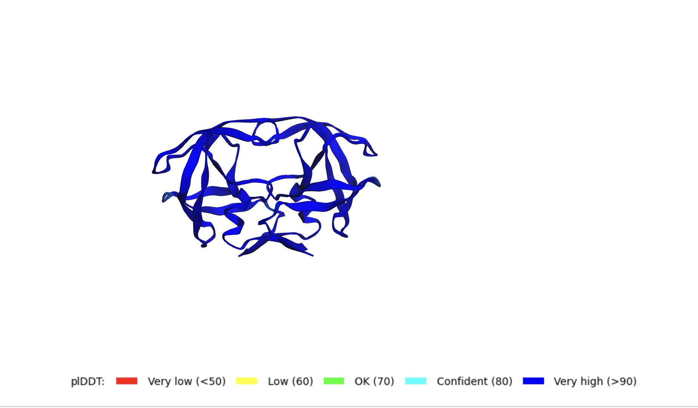
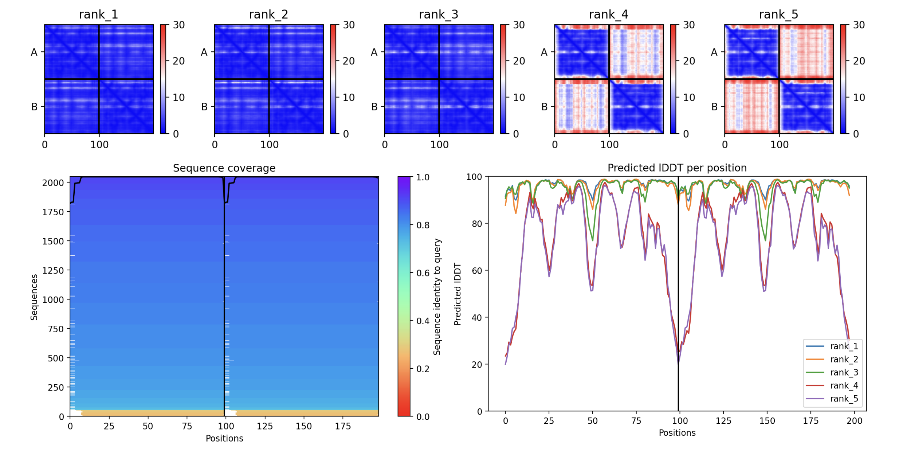
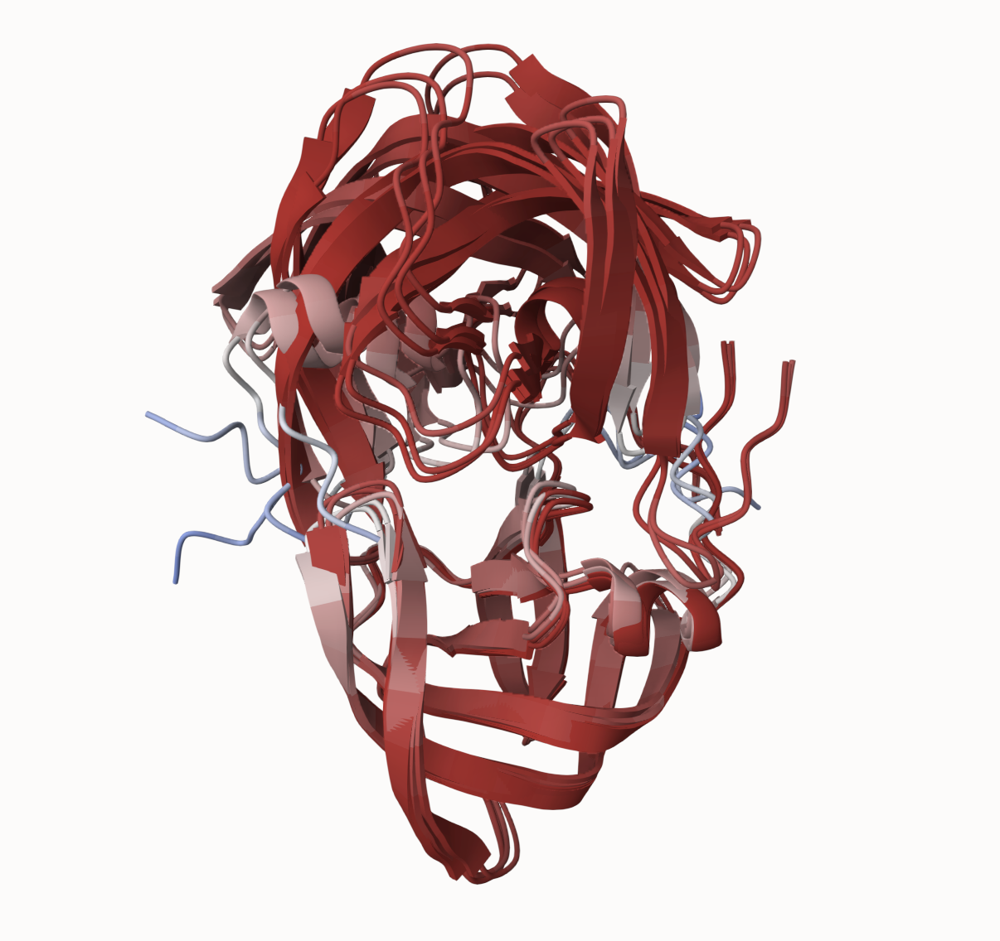
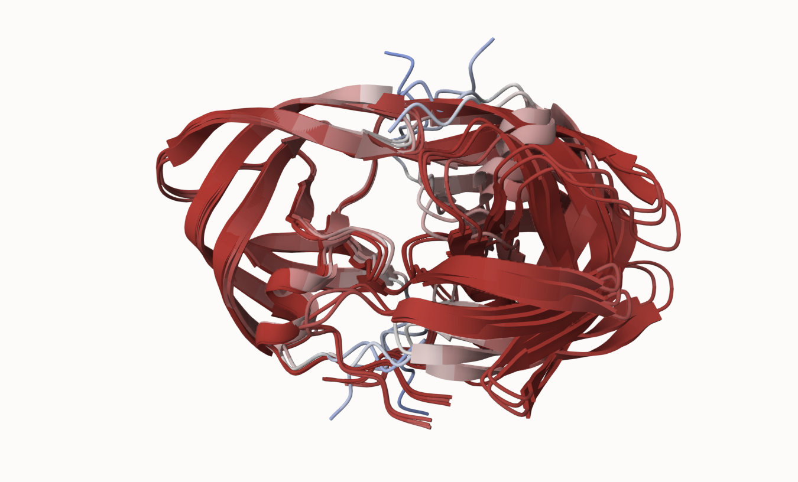
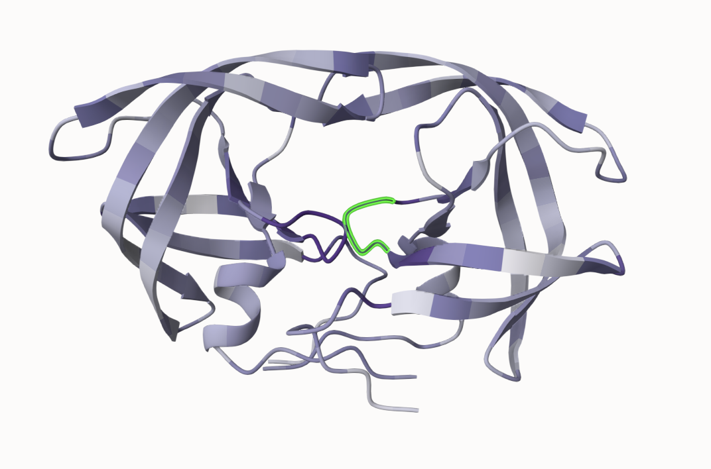

## Background 

In this hands-on session we will utilize AlphaFold to predict protein structure from sequence (Jumper et al. 2021).

Without the aid of such approaches, it can take years of expensive laboratory work to determine the structure of just one protein. With AlphaFOld, we can now accurately compute a typical protein structure in as little as ten minutes.

The PDB database (the main repository of experimental structures) only has **~250 thousand** structures (we saw this in the last lab). The main protein sequence database has over **200 million** sequences! Only 0.125% of known sequences have a known structure - this is called the "structure knowledge gap".

```{r}
(25000/ 20000000)*100
```
- Structures are much harder to determine than sequences
- They are expensive (on average ~$1million each)
- They take an average 3-5 years to solve!


## EBI AlphaFold Database

The EBI has a database of pre-computer AlphaFold (AF) models called AFDB.
This is growing overtime and can be useful to check before running AF ourselves.

## Running AlphaFold

We can download and run locally (on our own computers) but we need a GPU. Or we can use "cloud" computing to run this on someone elses computer :-)

We will use ColabFold <https://github.com/sokrypton/ColabFold> 

We previously found there was no AFDB entry for our HIV sequence: 

```
>HIV-Pr-Dimer
PQITLWQRPLVTIKIGGQLKEALLDTGADDTVLEEMSLPGRWKPKMIGGIGGFIKVRQYD
QILIEICGHKAIGTVLVGPTPVNIIGRNLLTQIGCTLNF:PQITLWQRPLVTIKIGGQLK
EALLDTGADDTVLEEMSLPGRWKPKMIGGIGGFIKVRQYDQILIEICGHKAIGTVLVGPT
PVNIIGRNLLTQIGCTLNF
```

We will use AlphaFold2_MMseqs2





## Interpreting Results



## Custom analysis of resulting models

```{r}
results_dir <- "hivpr_23119/"
```

```{r}
pdb_files <- list.files(path=results_dir,
                        pattern="*.pdb",
                        full.names = TRUE)

basename(pdb_files)
```

```{r}
library(bio3d)

pdbs <- pdbaln(pdb_files, fit=TRUE, exefile="msa")
```
```{r}
rd <- rmsd(pdbs, fit=T)

range(rd)
```

```{r}
library(pheatmap)

colnames(rd) <- paste0("m",1:5)
rownames(rd) <- paste0("m",1:5)
pheatmap(rd)
```
```{r}
pdb <- read.pdb("1hsg")
```

```{r}
plotb3(pdbs$b[1,], typ="l", lwd=2, sse=pdb)
points(pdbs$b[2,], typ="l", col="red")
points(pdbs$b[3,], typ="l", col="blue")
points(pdbs$b[4,], typ="l", col="darkgreen")
points(pdbs$b[5,], typ="l", col="orange")
abline(v=100, col="gray")
```

```{r}
core <- core.find(pdbs)

core.inds <- print(core, vol=0.5)
```

```{r}
xyz <- pdbfit(pdbs, core.inds, outpath="corefit_structures")
```


Core superposed structures colored by B-factor i.e. pLDDT.

```{r}
rf <- rmsf(xyz)

plotb3(rf, sse=pdb)
abline(v=100, col="gray", ylab="RMSF")
```

## Predicted Alignment Error for domains

```{r}
library(jsonlite)

# Listing of all PAE JSON files
pae_files <- list.files(path=results_dir,
                        pattern=".*model.*\\.json",
                        full.names = TRUE)
```

```{r}
pae1 <- read_json(pae_files[1],simplifyVector = TRUE)
pae5 <- read_json(pae_files[5],simplifyVector = TRUE)

attributes(pae1)

head(pae1$plddt) 
```

```{r}
pae1$max_pae
pae5$max_pae
```

```{r}
plot.dmat(pae1$pae, 
          xlab="Residue Position (i)",
          ylab="Residue Position (j)")
```

```{r}
plot.dmat(pae5$pae, 
          xlab="Residue Position (i)",
          ylab="Residue Position (j)",
          grid.col = "black",
          zlim=c(0,30))
```

```{r}
plot.dmat(pae1$pae, 
          xlab="Residue Position (i)",
          ylab="Residue Position (j)",
          grid.col = "black",
          zlim=c(0,30))
```

## Residue conservation from alignment file

```{r}
aln_file <- list.files(path=results_dir,
                       pattern=".a3m$",
                        full.names = TRUE)
aln_file
```

```{r}
aln <- read.fasta(aln_file[1], to.upper = TRUE)
```

```{r}
dim(aln$ali)
```

```{r}
sim <- conserv(aln)

plotb3(sim[1:99], sse=trim.pdb(pdb, chain="A"),
       ylab="Conservation Score")
```

```{r}
con <- consensus(aln, cutoff = 0.9)
con$seq
```

```{r}
m1.pdb <- read.pdb(pdb_files[1])
occ <- vec2resno(c(sim[1:99], sim[1:99]), m1.pdb$atom$resno)
write.pdb(m1.pdb, o=occ, file="m1_conserv.pdb")
```


Top ranked dimer model colored by sequence conservation. Conserved positions in a darker purple. The DTGA motif of one chain is highlighted in green.

```{r}
sessionInfo()
```

